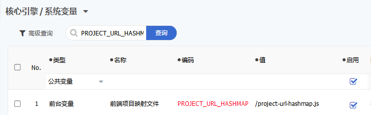

JEPAAS-FRONTEND 7.0.0
======================

## 项目简介
[**JEPAAS低代码开发平台**](https://gitee.com/jepaas/jepaas/blob/develop/README.md) 让软件开发人员和业务用户通过直观的可视化界面来构建应用程序 ，而不是传统的编写代码方式。 用户可以在开发平台灵活各个图形化控件，以构建业务流程、逻辑和数据模型等所需的功能，必要时还可以添加自己的代码。

**JEPAAS-FRONTEND前端开发项目** 用于前端人员开发个性化页面，并方便进行代码调试，打包，部署

## 开源插件
- [IM 即时通讯 1.0.0](docs/plugin/im/README.md)
- [首页展板 1.0.0](docs/plugin/home/README.md)
- [登录页 1.0.0](docs/plugin/login/README.md)


## 环境依赖
- node v8.11 以上

## 安装部署
- [安装node运行环境](http://nodejs.cn/download/)
- 项目部署命令
```
    npm install     //安装项目依赖包
    npm run dev     //启动开发环境
    npm run build   //发布项目插件
```
- npm淘宝镜像
```
    npm install -g cnpm --registry=https://registry.npm.taobao.org
```

- 代码开发
```
   1. 创建config/config.json,配置代理地址
   2. npm run dev 启动开发环境
   3. 开始开发调试
```
- 代码集成
```
   1. npm run build，发布项目插件
   2. 将 dist 目录中的代码放入jepaas项目，目录：jepaas /src/main/webapp
   3. 启动系统，添加系统变量，【PROJECT_URL_HASHMAP】:/project-url-hashmap.js
   4. 清空变量缓存，刷新页面开始使用
```

  功能菜单：开发->核心引擎->系统变量
      
## 目录结构

```
注： 标*的文件不加入git管理

├── config                     // 打包程序配置目录
|    ├── config                // 项目配置文件
|    |     └── jepaas.js       // 配置文件
|    ├── package               // 打包配置文件
|    |     ├── gulp            // gulp打包
|    |     ├── tpl             // webpack打包模板页
|    |     └── webpack         // webpack打包vue
|    ├── resourse              // 项目资源文件
|    |     └── jepaas          // 对应配置文件的资源目录
|    ├── server                // 服务文件
|    |     └── dev.js          // express服务文件
|    ├── config.js             // 基础配置文件
|    └── *cnofig.json          // 个性化配置文件
├── src                        // 业务代码目录
|    └─vue                     // vue 源码目录
|       ├─install.js           // 组件祖册工具类
|       ├─components           // 公共组件
|       │  ├─emoji             // 表情插件
|       │  └─listview          // 列表插件
|       ├─modules              // 业务组件
|       │  ├─demoboard         // demo展板
|       │  ├─home              // 首页源码
|       │  └─login             // 登录源码
|       └─static               // 资源目录
├── *dist                      // 发布目录
├── gulpfile.js
├── README.MD
└── package.json
```

## 开发说明
- config说明
  >config/**jepaas**.js和resourse/**jepaas**里的**jepaas**要跟package.json里scripts里的PROJECT=**jepaas**保持一致。
  这样做是为了多项目开发准备

  > config.json 是用于个性化配置使用，可以防止config.js被错误提交，影响他人使用

  >如果想替换资源文件，请参考resourse/jepaas里的文件

  >在config/jepaas.js里提供了登录页的配置信息，可以自行修改，也可以直接修改登录源码，重新打包

  > 本项目提供了 IM(im)，登录页(login)，首页(home)的源码，如果想修改，可自行打包，在config/jepaas.js中有默认配置entry入口信息，如果新增模块，可以在config/config.json中增加配置信息：entry:['model']，
  这个entry是增量的，不会覆盖默认entry配置

- vue业务组件开发说明：
  > 平台已经全局引入：Vue，Element-ui，EChart，不需要再import

  > 模块的打包的入口文件为：index.js

  > html标签名跟模块名一致,支持驼峰

  > 每个组件都要以 **pro-vue-模块名** 作为ROOT样式，避免污染其他组件样式

  > View.js组件接收参数vueInfo，参考View.js说明

## 授权协议声明

1. 由于平台战略规划，平台开源部分代码，对于已开源的代码，授权协议采用AGPL3.0协议。
2. 您可以免费使用、修改和衍生代码，但不允许修改后和衍生的代码作为闭源软件发布。
3. 在修改和衍生的代码中需要带有原来代码的协议、版权声明和其它原作者规定需要包含的说明。
4. 如果要提供修改给官方库，请提交PR，我们会审核并测试相关PR，通过后我们会合并至主分支。
5. 您可以用于商业软件，但是需要遵循AGPL3.0协议及上述条款。

## 联系我们

- 公司：北京凯特伟业科技有限公司
- 电话：010-82809807 / 400-0999-235
- QQ群：462151894


